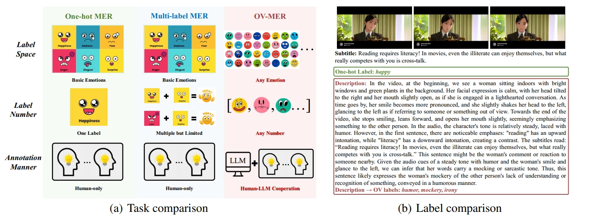
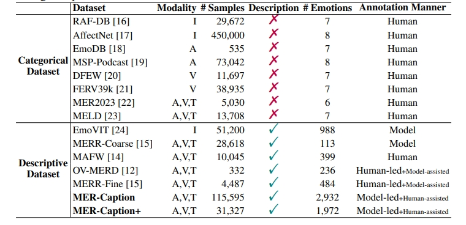

<p align="center">
      
<p>

<h3 align="center"><a href="https://arxiv.org/abs/2410.01495" style="color:#9C276A">
OV-MER &</a><a href="https://arxiv.org/abs/2501.16566" style="color:#9C276A">
AffectGPT</a></h3>
<h5 align="center"> If our project helps you, please give us a star ⭐ on GitHub to support us. 🙏🙏 </h2>

<h5 align="center">


[](AffectGPT/LICENSE)
</h5>

## 🎯 What Can AffectGPT Do?

AffectGPT is a powerful multimodal large language model (MLLM) designed for comprehensive emotion understanding. Here's what it can do:

### Core Capabilities
- **🎭 Open-Vocabulary Emotion Recognition**: Predict any number and category of emotions, breaking free from fixed emotion taxonomies used in traditional systems.
- **🎬 Multimodal Analysis**: Process and analyze emotions from multiple sources simultaneously:
  - Video frames (visual expressions, body language)
  - Audio signals (voice tone, prosody, acoustic features)
  - Text transcripts (spoken content, linguistic cues)
  - Facial features (detailed facial expressions)

### Key Features
- **📊 Emotion Label Prediction**: Generate emotion labels from an open vocabulary of 236+ emotion categories
- **💬 Emotion Description**: Provide detailed natural language descriptions and reasoning about emotional states
- **🔄 Flexible Input**: Work with different input modalities (audio-only, video-only, or multimodal)
- **🌐 Multilingual Support**: Handle both Chinese and English content

### Use Cases
- Analyze emotional states in video conversations and interviews
- Understand complex emotional dynamics in social interactions
- Provide explainable emotion recognition with detailed reasoning
- Support emotion AI research with comprehensive benchmarking tools

### Technical Highlights
- Built on state-of-the-art foundation models (Qwen2.5-7B-Instruct LLM)
- Trained on large-scale datasets (132,171+ samples)
- Achieves top performance on MER-UniBench across 9 datasets
- Supports both zero-shot inference and fine-tuned models

## ✨ OV-MER Task

**OV-MER** transitions from *traditional MER* to a framework that enables the prediction of *any number and category of emotions*, thereby advancing emotion AI toward real-world applicability by capturing the full spectrum of human emotions.

**(a) Task Comparison**: We compare the differences among three tasks (one-hot MER, multi-label MER, and OV-MER) across three aspects (label space, label number, and annotation manner).

**(b) Label Comparison**: We provide an example to visualize the one-hot and OV labels.



## 🚀 Dataset

### OV-MERD (Formerly known as the EMER dataset)
It is the first dataset we construct for the OV-MER task. This dataset is available at: https://huggingface.co/datasets/MERChallenge/MER2025
```bash
dataset
├── mer2025-dataset
|   ├── video # all training data, including 132,171 samples
|   ├── audio # pre-extracted audio
|   ├── openface_face # # pre-extracted face files
|   ├── subtitle_chieng.csv # pre-extracted subtitle content
|   ├── track2_train_ovmerd.csv # OV-MERD Dataset (OV labels)
|   ├── track3_train_ovmerd.csv # OV-MERD Dataset (Description)
```

### MER-Caption+

We adopt a model-led, human-assisted annotation strategy to strike a balance between label quality and dataset size. This dataset is available at: https://huggingface.co/datasets/MERChallenge/MER2025
```bash
dataset
├── mer2025-dataset
|   ├── video # all training data, including 132,171 samples
|   ├── audio # pre-extracted audio
|   ├── openface_face # # pre-extracted face files
|   ├── subtitle_chieng.csv # pre-extracted subtitle content
|   ├── track2_train_mercaptionplus.csv # MER-Caption+ Dataset (OV labels)
|   ├── track3_train_mercaptionplus.csv # MER-Caption+ Dataset (Description)
```


<p></p>


## ✨ MER-UniBench
We build MER-UniBench, which encompasses typical MER tasks with tailored metrics. This benchmark can offer comprehensive evaluation results for MLLM-based emotion understanding.

```bash
## MER-UniBench includes 9 datasets
dataset 
# Available at: https://pan.baidu.com/s/1kbfs5pG_hAri0QwvQl-Ecg?pwd=b9vn
# Alternative link: https://1024terabox.com/s/1AE7uAU3Ib8aRBSyF1TMpow
├── mer2023-dataset-process
├── mer2024-dataset-process
├── sims-process
├── simsv2-process
├── cmumosi-process
├── cmumosei-process
├── iemocap-process
├── meld-process
# Available at: https://pan.baidu.com/s/1nBTw_ujSTQPAMyIs5Qv8Zw?pwd=k8tj
# Alternative link: https://1024terabox.com/s/1O130fc81FVsGGsrjLuHyDA
├── ovmerdplus-process
```

## 🗝️ Solution

### Zero-shot Baselines
We provide zero-shot baselines for MLLMs on the OV-MER task on **./OV-MER**.
```bash
OV-MER
├── Chat-UniVi
├── LLaMA-VID
├── ...
```

### Specific Framework: AffectGPT
We provide specifically designed framework, AffectGPT, for the OV-MER task on **./AffectGPT**.
```bash
AffectGPT
├── models # Available at: https://pan.baidu.com/s/1IvC4H7Xt1AzMFocGMBBbHQ?pwd=hzf9
│   ├── chinese-hubert-large # audio encoders
│   ├── clip-vit-large-patch14 # video encoders
│   ├── Qwen2.5-7B-Instruct # LLM
├── output # Available at: https://pan.baidu.com/s/1wtKBxHQP4eCUSAVuBrOzag?pwd=27sh
│   ├── emercoarse_highlevelfilter4_outputhybird_bestsetup_bestfusion_lz # Training on mercaptionplus + input face
```

## 📑 Citation

If you find AffectGPT useful for your research and applications, please cite using this BibTeX:
```bibtex
# MER-Caption dataset, MER-Caption+ dataset, AffectGPT Framework
@article{lian2025affectgpt,
  title={AffectGPT: A New Dataset, Model, and Benchmark for Emotion Understanding with Multimodal Large Language Models},
  author={Lian, Zheng and Chen, Haoyu and Chen, Lan and Sun, Haiyang and Sun, Licai and Ren, Yong and Cheng, Zebang and Liu, Bin and Liu, Rui and Peng, Xiaojiang and others},
  journal={ICML (Oral, Top 1%)},
  year={2025}
}

# OV-MERD dataset
@article{lian2024open,
  title={Open-vocabulary Multimodal Emotion Recognition: Dataset, Metric, and Benchmark},
  author={Lian, Zheng and Sun, Haiyang and Sun, Licai and Chen, Lan and Chen, Haoyu and Gu, Hao and Wen, Zhuofan and Chen, Shun and Zhang, Siyuan and Yao, Hailiang and others},
  journal={ICML},
  year={2024}
}

# EMER task
@article{lian2023explainable,
  title={Explainable Multimodal Emotion Recognition},
  author={Lian, Zheng and Sun, Haiyang and Sun, Licai and Gu, Hao and Wen, Zhuofan and Zhang, Siyuan and Chen, Shun and Xu, Mingyu and Xu, Ke and Chen, Kang and others},
  journal={arXiv preprint arXiv:2306.15401},
  year={2023}
}

# MER2023 Dataset
@inproceedings{lian2023mer,
  title={Mer 2023: Multi-label learning, modality robustness, and semi-supervised learning},
  author={Lian, Zheng and Sun, Haiyang and Sun, Licai and Chen, Kang and Xu, Mngyu and Wang, Kexin and Xu, Ke and He, Yu and Li, Ying and Zhao, Jinming and others},
  booktitle={Proceedings of the 31st ACM international conference on multimedia},
  pages={9610--9614},
  year={2023}
}

# MER2024 Dataset
@inproceedings{lian2024mer,
  title={Mer 2024: Semi-supervised learning, noise robustness, and open-vocabulary multimodal emotion recognition},
  author={Lian, Zheng and Sun, Haiyang and Sun, Licai and Wen, Zhuofan and Zhang, Siyuan and Chen, Shun and Gu, Hao and Zhao, Jinming and Ma, Ziyang and Chen, Xie and others},
  booktitle={Proceedings of the 2nd International Workshop on Multimodal and Responsible Affective Computing},
  pages={41--48},
  year={2024}
}
```

## 👍 Acknowledgement
We evaluate the performance of various LLM-based baselines on OV-MERD, including [**SECap**](https://github.com/thuhcsi/SECap), [**SALMONN**](https://github.com/bytedance/SALMONN), [**Qwen-Audio**](https://github.com/QwenLM/Qwen-Audio), [**Otter**](https://github.com/Luodian/Otter), [**OneLLM**](https://github.com/csuhan/OneLLM), [**PandaGPT**](https://github.com/yxuansu/PandaGPT), [**VideoChat**](https://github.com/OpenGVLab/Ask-Anything/tree/main/video_chat), [**VideoChat2**](https://github.com/OpenGVLab/Ask-Anything/tree/main/video_chat2), [**Video-LLaMA**](https://github.com/DAMO-NLP-SG/Video-LLaMA), [**Video-LLaVA**](https://github.com/PKU-YuanGroup/Video-LLaVA), [**Video-ChatGPT**](https://github.com/mbzuai-oryx/Video-ChatGPT), [**LLaMA-VID**](https://github.com/dvlab-research/LLaMA-VID), [**mPLUG-Owl**](https://github.com/X-PLUG/mPLUG-Owl), and [**Chat-UniVi**](https://github.com/PKU-YuanGroup/Chat-UniVi). We extend our gratitude to the authors for their excellent work.

## 🔒 License

This project is released under the Apache 2.0 license as found in the LICENSE file.
The service is a research preview intended for **non-commercial use ONLY**. Please get in touch with us if you find any potential violations.
